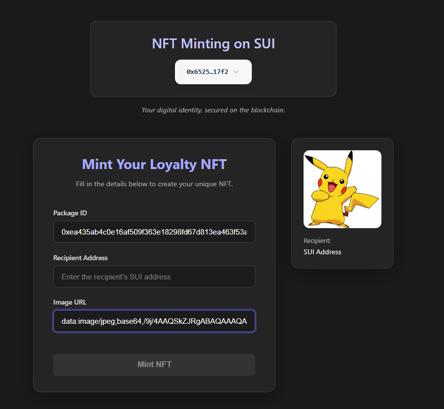
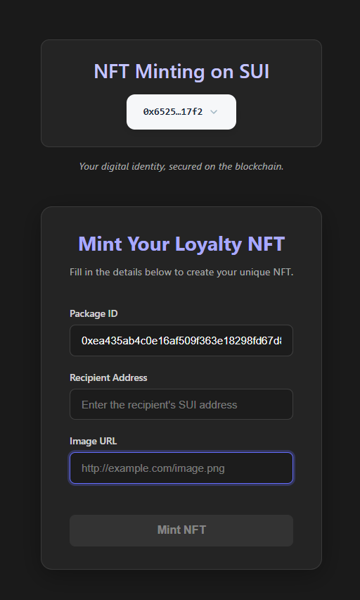

# SUI NFT Minting DApp

A React-based decentralized application for minting loyalty NFTs on the SUI blockchain.

## Features

- Connect your SUI wallet
- Mint unique loyalty NFTs by providing recipient address and image URL
- Preview your NFT before minting

## Screenshots


*Mint your loyalty NFT by entering the required details.*


*Preview your NFT before minting.*

## Getting Started

### Prerequisites

- Node.js (v18+ recommended)
- npm

### Installation

```sh
npm install
```

### Running Locally

```sh
npm run dev
```

Open [http://localhost:5173](http://localhost:5173) in your browser.

## Usage

1. Connect your SUI wallet using the Connect button.
2. Enter the on-chain Package ID, recipient SUI address, and image URL.
3. Preview your NFT.
4. Click "Mint NFT" to mint your loyalty card on SUI.

## Tech Stack

- React
- Vite
- @mysten/dapp-kit
- SUI blockchain

##